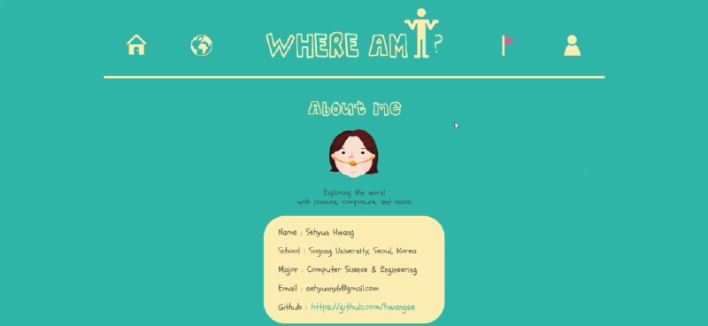

# Where-am-i
#### [Where am I](https://whereami.ml/) is a personal website.
> The web page functions as a photo album.  
> The title `"Where am I?"` means "Which country I visited?" from the past point of view. 
> The website is made up of five pages in one scroll.
> You can see the main image changing(day to night) by hovering the mouse on it. 
> Have a joyful time at my website. Thank you! 😸 
 
ⓒ copyright of all images and logos are belongs to me.
 

## Main logo
</img>
 
 

## Maps
</img>
 
 

## Albums
</img>

</img>
 
 

## Responsive
</img>

</img>

</img>

